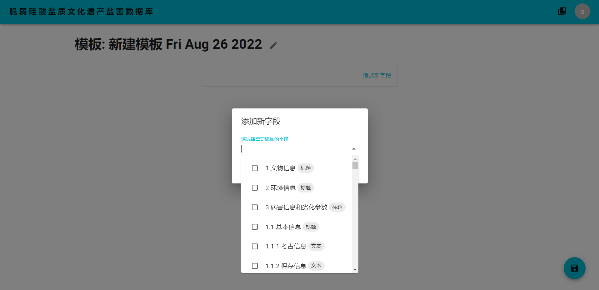
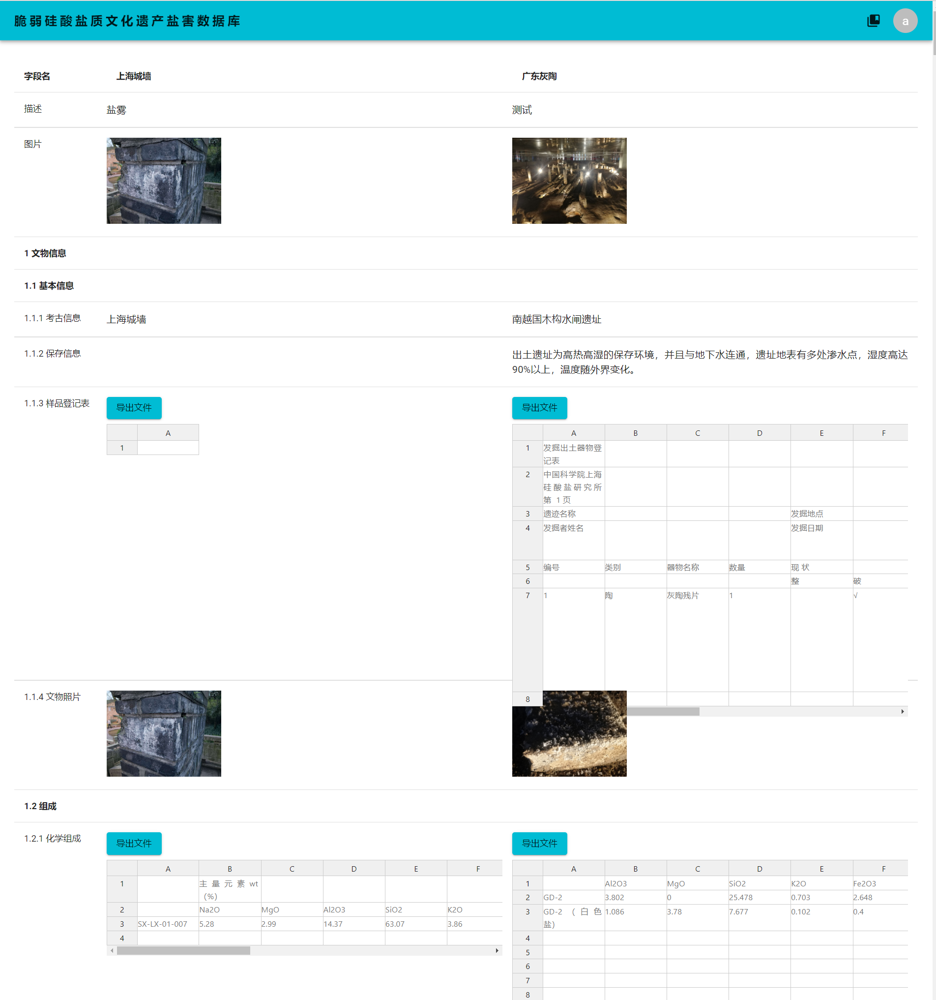

# Formily

一个高扩展性的网页表单管理系统，支持3D模型、表格、图表、文件等十余个复杂字段类型。

See also: https://github.com/OpenSUST/BE

## 特性

- 拥有以下字段：3D模型、表格（可编辑）、图表（基于Echarts，可自定义显示方式）、文件（可上传下载）、图片、在线文档（仅浏览，支持 PPT、Word 文档和复杂 Excel 表格）、文本、数字
- 可更改网页版权和名字等信息
- 拥有多账户管理系统，可高度自定义用户权限
- 可自定义表格模板
- 可选择多个不同项目进行比较

## 截图

### 系统流程图


### 字段管理


### 模板管理



### 项目更新


### 多个项目之间比较



## 使用

```bash
npm install --legacy-peer-deps
```

## 开发

```bash
npm start
```

## 构建

```bash
npm run build
```

## 开源协议

[AGPL-3.0](./LICENSE)

## 作者

Shirasawa
